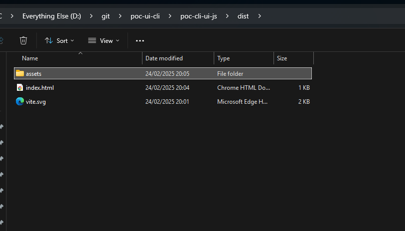
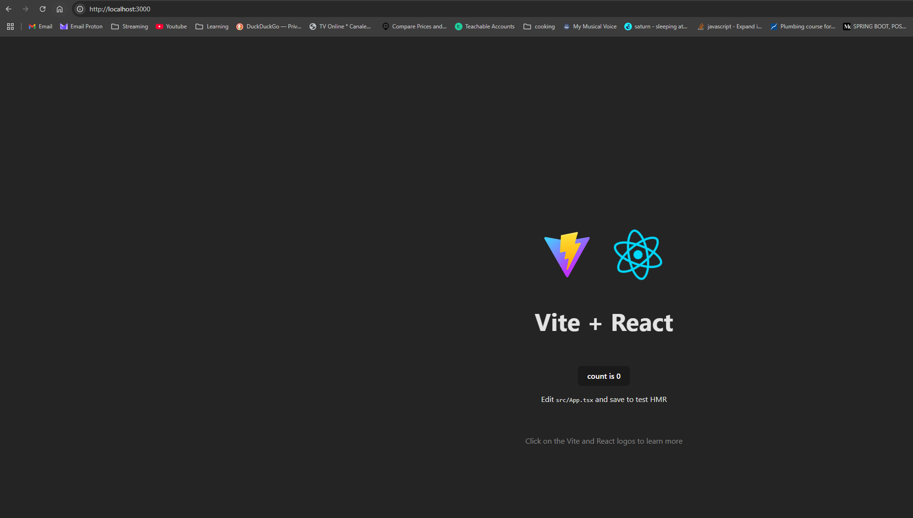
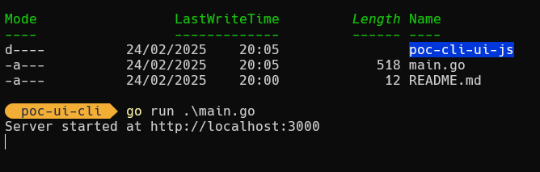
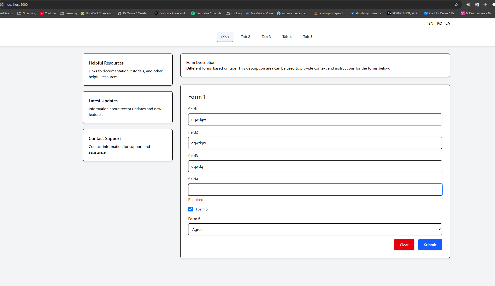
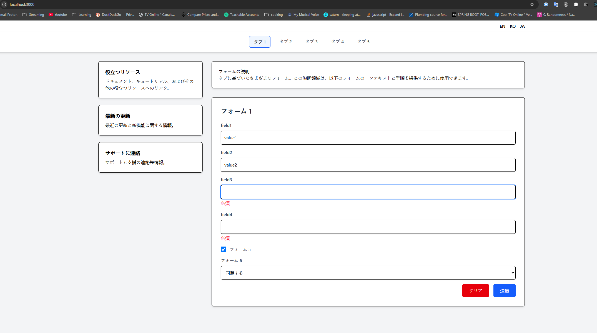

# poc-ui-cli

1. Go to `poc-cli-ui-js` folder.
2. Run `npm run build` -> You'll get a `dist` folder.
3. Go to `main.go` file and point the fileserver to the location of the `dist` folder.
4. Run server with `go run main.go` or other options.
5. Go to browser at `localhost:3000` and see the react-app running.

Screenshots:

* bundled react application 

* default application running
 
* server started
 
* form mocks
 
* translated form
 

